# 🌐 SportsScraper: Sports Deals Comparison Engine

**Description:** A real-time metasearch and price-comparison platform for the apparel retail sector. The system leverages advanced **Web Scraping** techniques to centralize product offers from multiple e-commerce platforms, allowing users to optimize costs through data transparency.

---

## 🧾 Commercial Version (Business Proposal)

### 🚀 SportsScraper Commerce: Price Intelligence for Sports & Apparel Retail

**SportsScraper Commerce** is a **price intelligence** platform built for sportswear/apparel brands and retailers who need to monitor the market in real time, detect competitive opportunities, and optimize pricing strategy—without manually browsing dozens of stores.

Instead of visiting each e-commerce site one by one, the system centralizes key data (price, sizes, shipping cost, availability, promotions) from multiple sources and displays it in a single interface, ready for analysis and decision-making.

### ✅ Value Proposition
- **Full market visibility:** centralized comparison of prices and stock across multiple stores.
- **Time savings:** automates the collection of competitive data.
- **Data-driven decisions:** adjust pricing, campaigns, and replenishment based on real trends.
- **Smart alerts:** notifications when a competitor changes price or a product stock status changes.
- **Price history:** daily/weekly tracking to identify patterns and seasonality.

### 👤 Target Customers
- Sports retail stores
- Sportswear & footwear brands
- E-commerce teams / marketplace managers
- Pricing & competitive intelligence analysts
- Performance marketing agencies (to optimize campaigns based on price position)

### 🧩 Commercial Features (MVP+)
**1) Competitive Dashboard**
- Price ranking by product and by store
- Automatic “lowest price” and “average price” detection
- Summary views by brand/category

**2) Alerts & Automation**
- Alerts for:
  - price drops (percentage or fixed value)
  - stock / available sizes changes
  - product appearance/disappearance
- Scheduled scraping (every X hours)

**3) Product Intelligence (Advanced Matching)**
- Groups identical products even if listings use different naming conventions
- Matching based on:
  - brand + model
  - SKU / reference (when available)
  - text similarity and image similarity (optional)

**4) Export & API**
- Export to **CSV / Excel**
- REST API to integrate data with:
  - BI dashboards (Power BI / Tableau)
  - ERP / inventory systems
  - dynamic pricing engines

### 🔐 Compliance & Best Practices
- Respect for robots.txt and rate limits
- Extraction logs and traceability
- Proxy rotation for stability (optional)
- Ethical and responsible scraping approach

### 💼 Monetization Models (Examples)
- **Monthly subscription tiers**
  - Basic: X products / X stores / daily scraping
  - Pro: scraping every few hours + alerts + price history
  - Enterprise: API + integrations + dedicated deployment + support
- **Annual B2B license**
- **Managed service** (scraping + dashboard + reporting)

### 🏗️ Recommended Architecture (Commercial-Grade)
- Frontend: SPA (React/Vue) + Tailwind/Material UI
- Backend: Node.js or Python (FastAPI)
- Scraping: Playwright (headless) + queues (Redis/RabbitMQ)
- Storage: PostgreSQL + event table for price history
- Observability: logs, retries, monitoring per store

---

## 🎯 1. General Objective

Design and develop an end-to-end metasearch and price-comparison system for the apparel retail sector, based on advanced web scraping techniques, in order to centralize product offers from multiple e-commerce platforms into a single interface that enables informed decision-making through data transparency and user cost optimization.

---

## 🌍 2. Usage Context

**Who will use the system?** Consumers in Colombia who shop for sportswear and fashion and want to compare prices from well-known brands without browsing each store individually.

**How will it be used?** The user enters a product reference or category in the search bar; the system queries the extraction engines and displays a comparison grid with prices, size availability, and direct purchase links.

---

## 📋 3. System Requirements

### 3.1 Functional Requirements
**FR01:** Asynchronous extraction of data (price, sizes, shipping) from sites such as Zalando or Google Shopping.  
**FR02:** Data normalization to unify different currency formats and measurement units.  
**FR03:** Product matching algorithm to group identical items from different providers.  
**FR04:** Advanced filters by price range, brand, and stock availability.

### 3.2 Non-Functional Requirements
**NFR01:** Responsive UI adapted to mobile and desktop devices.  
**NFR02:** Single Page Application (SPA) architecture for smooth navigation.  
**NFR03:** Concurrency handling to support multiple simultaneous scraping requests.  
**NFR04:** Compliance with robots.txt policies for ethical scraping.

---

## 🧠 4. UML Diagrams

### 🔍 UC1: Search Item
The user searches for a specific item to centralize and compare available market options.

**Step Sequence**
- **Input:** The user enters a term (e.g., “Running Shoes”) in the Search Interface.
- **Request:** The UI sends the query to the Search Controller.
- **Query:** The Controller requests matching records from the Database.
- **Response:** The Database returns a list of Master Products.
- **Output:** The Controller ranks results by relevance and returns them to the UI.

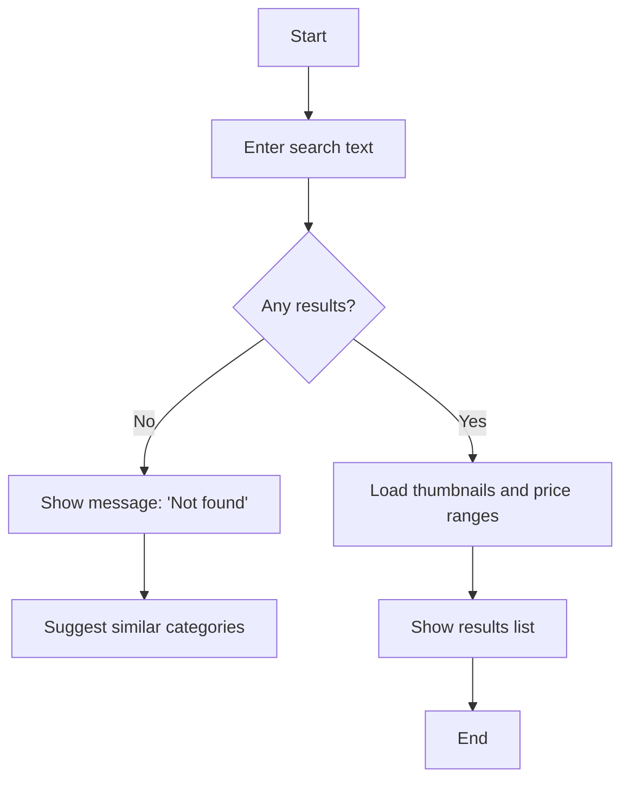

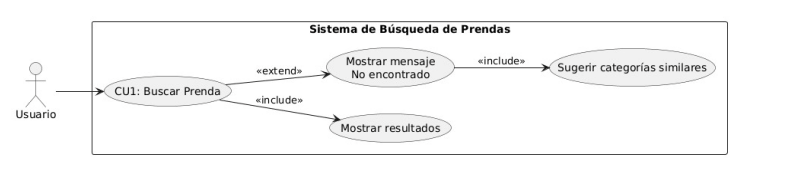  
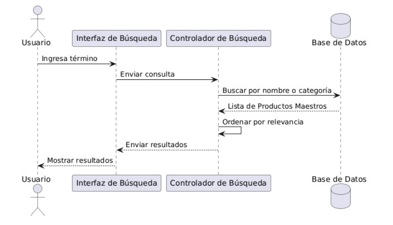  
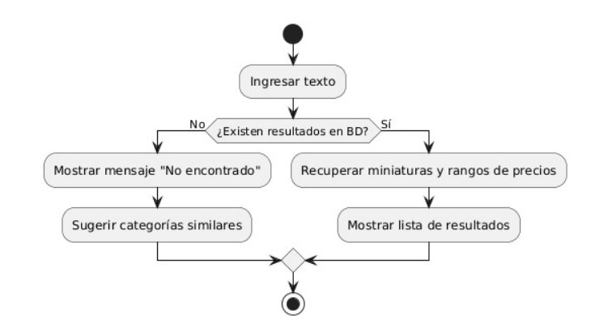

### 💰 UC2: Compare Prices
Core functionality: allows the user to identify the most competitive offer by centralizing data from multiple stores.

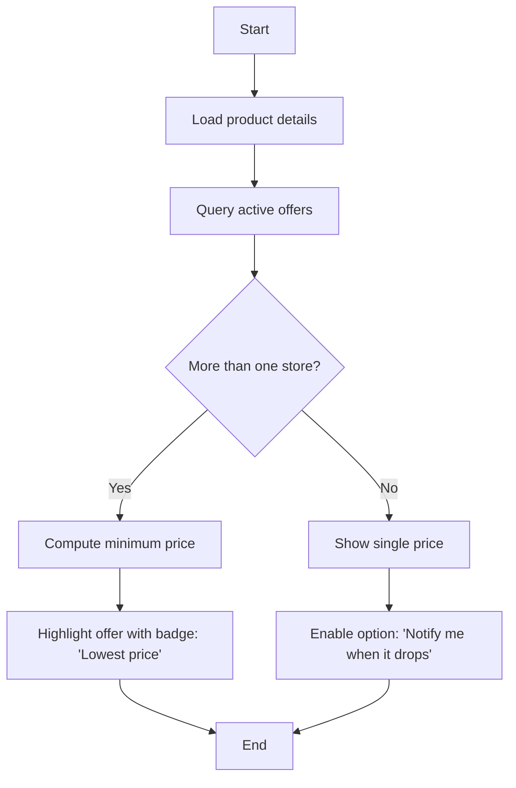

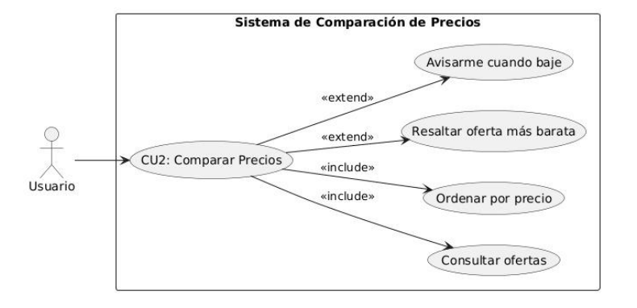  
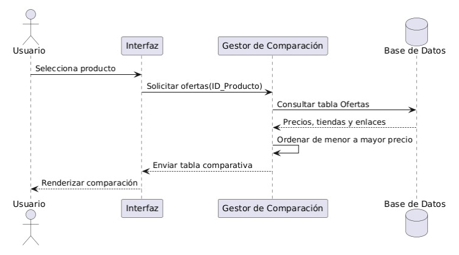  
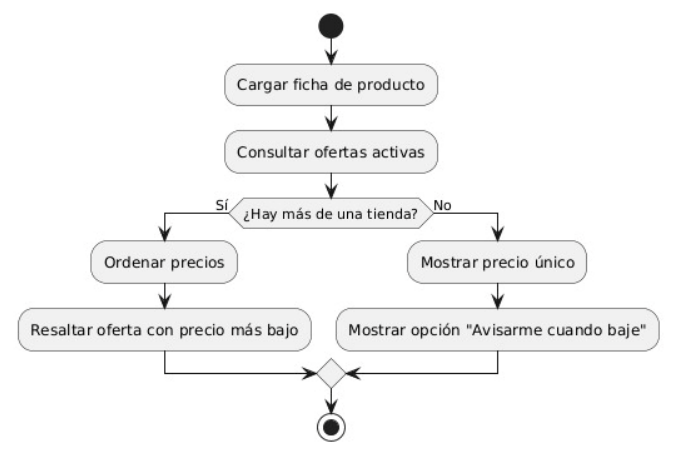

### 🔔 UC3: Set Price Alert
The user wants to be proactively notified when the scraping engine detects a price drop below a specific threshold.

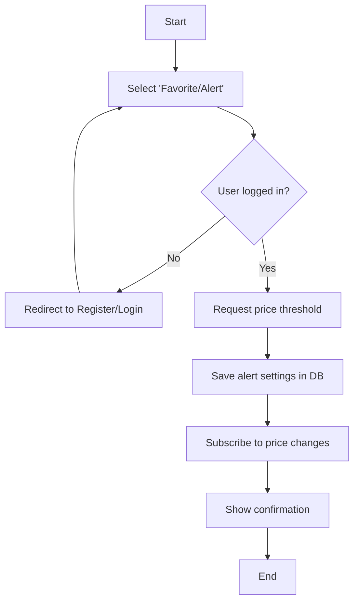

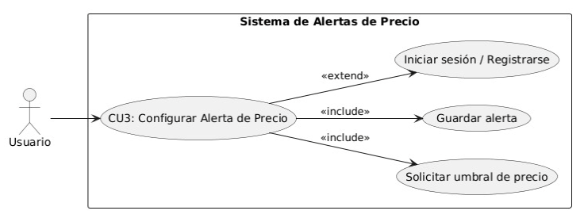  
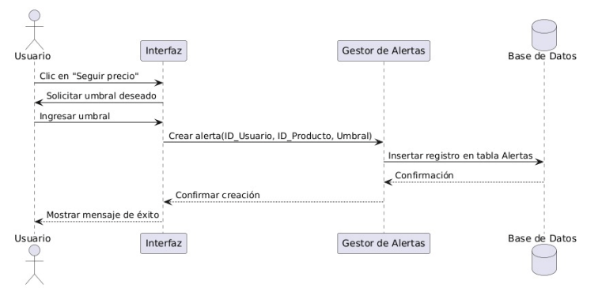  
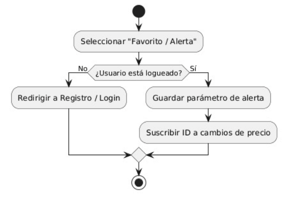

### ⚙️ UC4: Run Extraction (Scraping)
Backend process responsible for collecting, cleaning, and persisting data from external retail platforms.

```mermaid
graph TD
    A[Start] --> B[Access store URL]
    B --> C{Successful load?}
    C -- No --> D[Request new proxy]
    D --> B
    C
